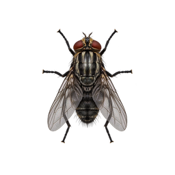

<div align="center">
  
  <h1>Your Friend</h1>
  <p>一只会在桌面上陪你五分钟的写实苍蝇桌宠。</p>
  <p>
    
    
    
  </p>
</div>

桌面很安静的时候，一只写实苍蝇会突然出现：有时慢慢爬行，有时突然起飞，在屏幕间变速穿梭；它偶尔只停几秒，也可能安静待上几十秒，或者认真搓搓前腿。你点它，它会立刻飞走。五分钟后，它会悄悄离开。

这是一个轻量、短暂、带一点恶作剧气质的桌宠陪伴实验。程序使用原生 Win32 与 GDI+ 实现，运行期间不显示任务栏图标和控制面板。

## 功能

- **写实外观**：红褐色复眼、黑灰胸腹、半透明翅膀与六足细节。
- **接近真实尺寸**：根据 Windows DPI 缩放，主体长度约为 7–9 mm。
- **自然变速**：在 22–78 px/s 的爬行和 360–920 px/s 的飞行之间随机切换，段内速度平滑变化。
- **随机停留**：短、中、长三档加权随机停留，少数情况下会停留 18–45 秒；停下时仍会轻微振翅。
- **点击反馈**：点击苍蝇本体后，它会立即加速飞走。
- **多屏支持**：可在整个 Windows 虚拟桌面范围内移动。
- **五分钟陪伴**：运行满五分钟后自动退出。
- **单实例运行**：重复双击不会生成一群苍蝇。

## 下载与运行

1. 下载 [`DesktopFly_5min.exe`](https://github.com/haozheng-zhang/your-friend/releases/latest/download/DesktopFly_5min.exe)。
2. 双击即可运行，无需安装，无需管理员权限。
3. Windows 首次运行时可能提示“未知发布者”。这是因为项目没有购买代码签名证书，可选择“更多信息 → 仍要运行”。
4. 五分钟后程序自动结束。

支持 Windows 10/11 64 位系统。

## 它会对电脑做什么

| 行为 | 说明 |
| --- | --- |
| 联网 | 不会 |
| 写入文件 | 不会 |
| 修改注册表 | 不会 |
| 添加开机启动 | 不会 |
| 请求管理员权限 | 不会 |
| 后台常驻 | 五分钟后自动退出 |

系统始终保留最终控制权，可在任务管理器中结束 `DesktopFly_5min.exe`。

## 实现思路

程序启动后从可执行文件资源区读取两张透明 PNG，并提前生成 64 个飞行方向的旋转帧。Win32 分层窗口负责逐像素透明与桌面置顶，16 ms 定时器驱动运动状态机。

| 状态 | 表现 | 离开条件 |
| --- | --- | --- |
| `Crawl` | 低速爬行，缓慢改变速度和方向 | 随机起飞或进入停留 |
| `Flight` | 快速飞行，频繁改变速度和方向 | 随机落地爬行或进入停留 |
| `Rest` | 保持静止 | 停留时间结束或被点击 |
| `Grooming` | 两套姿态交替，模拟搓前腿 | 停留时间结束或被点击 |
| `Exit` | 销毁窗口并释放图像资源 | 总运行时间达到五分钟 |

透明区域会把鼠标事件交还给桌面，只有苍蝇本体能够被点击。

## 从源码构建

### Windows + Visual Studio 2022

需要安装“使用 C++ 的桌面开发”和 CMake：

```powershell
cmake -S . -B build
cmake --build build --config Release
```

生成文件位于 `build/Release/DesktopFly_5min.exe`。

### Linux + MinGW-w64

```bash
sudo apt install g++-mingw-w64-x86-64
bash scripts/build-mingw-linux.sh
```

生成文件位于 `dist/DesktopFly_5min.exe`。

## 项目结构

```text
your-friend/
├─ assets/                     # 飞行与搓前腿透明素材
├─ dist/DesktopFly_5min.exe    # Windows 单文件可执行程序
├─ scripts/                    # 交叉编译脚本
├─ src/                        # Win32 / GDI+ 源码与资源定义
├─ CMakeLists.txt
└─ README.md
```

## 技术栈

- C++17
- Win32 API
- GDI+ / layered window
- Windows DPI awareness
- CMake / MinGW-w64
